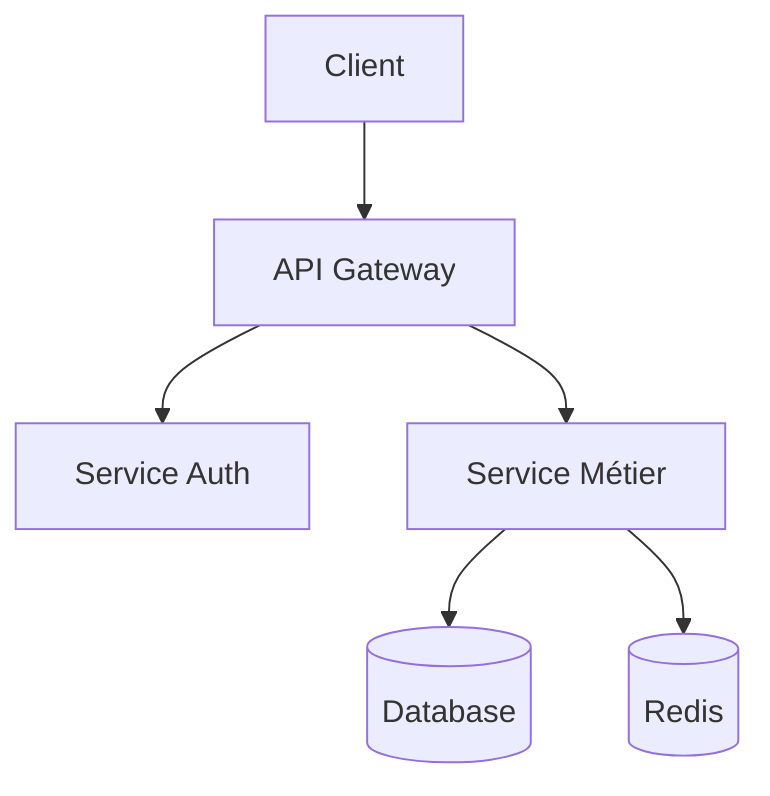
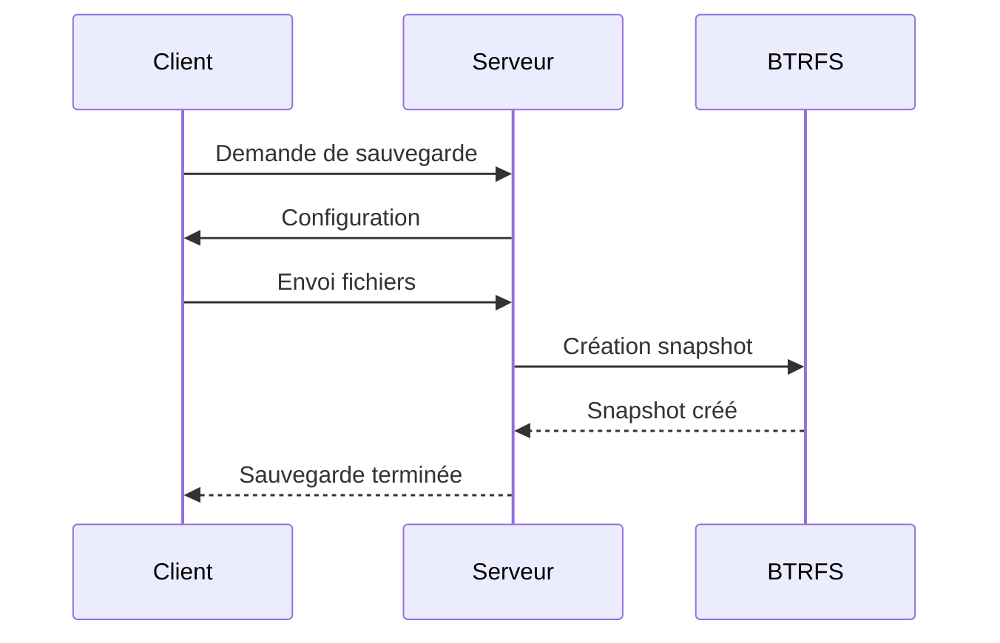

# Technical Documentation Expert

Ce skill transforme GitHub Copilot en expert en documentation technique, capable de créer une documentation professionnelle, claire et facilement navigable.

## Quand utiliser ce skill

- Création de documentation d'architecture système
- Documentation d'API (REST, GraphQL, gRPC)
- Guides d'installation et de déploiement
- Documentation de fonctionnalités
- Guides de contribution
- Documentation de migration
- Diagrammes techniques
- Troubleshooting et FAQ

## Principes de documentation

### 1. Clarté et Accessibilité

- **Écriture simple et directe** : Utilisez un langage clair, évitez le jargon inutile
- **Public cible** : Identifiez et adaptez-vous au niveau technique du lecteur
- **Navigation intuitive** : Structure logique avec table des matières, liens internes, breadcrumbs

### 2. Structure Standard

Chaque document technique doit suivre cette structure de base :

```markdown
# Titre du Document

> Résumé en une phrase de ce que couvre le document

## Table des matières
- [Section 1](#section-1)
- [Section 2](#section-2)

## Vue d'ensemble
Contexte, objectif et portée du document.

## Prérequis
Ce qu'il faut savoir/avoir avant de lire ce document.

## Contenu Principal
[Organisé en sections logiques]

## Exemples
Cas d'usage concrets et exemples de code.

## Référence
Liens vers documentation complémentaire.

## Troubleshooting
Problèmes courants et solutions.
```

### 3. Types de Documentation

#### Documentation d'Architecture

```markdown
# Architecture de [Composant/Système]

## Contexte
- Pourquoi cette architecture ?
- Problème résolu
- Contraintes techniques

## Vue d'ensemble
[Diagramme de haut niveau]

## Composants
### Composant 1
- Responsabilité
- Technologies
- Interfaces

## Flux de données
[Diagrammes de séquence]

## Décisions techniques (ADR)
- **Décision** : [Description]
- **Contexte** : [Pourquoi]
- **Conséquences** : [Impact]

## Considérations
- Performance
- Scalabilité
- Sécurité
- Maintenabilité
```

#### Documentation d'API

```markdown
# API [Nom]

## Authentification
[Méthode, tokens, headers]

## Endpoints

### `GET /resource/{id}`
**Description** : Récupère une ressource par ID

**Paramètres** :
- `id` (path, required) : Identifiant unique

**Réponse** :
```json
{
  "id": "123",
  "name": "example"
}
```

**Codes d'erreur** :

- `404` : Ressource non trouvée
- `401` : Non authentifié

**Exemple** :

```bash
curl -H "Authorization: Bearer TOKEN" \
  https://api.example.com/resource/123
```

```

#### Guide d'Installation

```markdown
# Installation de [Projet]

## Prérequis système
- OS : Linux (Ubuntu 20.04+), macOS, Windows 10+
- RAM : 4GB minimum
- Dépendances : Node.js 18+, Docker 24+

## Installation rapide
```bash
# Clone le dépôt
git clone https://github.com/org/project
cd project

# Installation
npm install

# Configuration
cp .env.example .env

# Lancement
npm start
```

## Installation détaillée

### Étape 1 : Préparation de l'environnement

[Instructions détaillées]

### Étape 2 : Configuration

[Chaque paramètre expliqué]

### Étape 3 : Vérification

```bash
npm run verify
```

## Troubleshooting

### Erreur : "Module not found"

**Cause** : Dépendances manquantes
**Solution** :

```bash
rm -rf node_modules package-lock.json
npm install
```

```

### 4. Diagrammes et Visualisations

Utilisez Mermaid pour les diagrammes intégrés :

```markdown
## Architecture du système



## Flux de sauvegarde



```

### 5. Exemples de Code

Les exemples doivent être :
- **Complets** : Exécutables tels quels
- **Commentés** : Explications des parties complexes
- **Réalistes** : Cas d'usage réels

```markdown
## Exemple : Créer un client de sauvegarde

```rust
use woodstock_client::{Client, Config};

// Configuration du client
let config = Config {
    server_url: "https://backup.example.com".to_string(),
    cert_path: "/etc/woodstock/client.crt".into(),
    // ... autres paramètres
};

// Initialisation
let client = Client::new(config)?;

// Lancement de la sauvegarde
client.backup("/home/user/data").await?;
```

```

### 6. Organisation des Fichiers

Structure recommandée pour la documentation :

```

docs/
├── README.md                 # Point d'entrée principal
├── architecture/
│   ├── README.md            # Vue d'ensemble
│   ├── system-design.md     # Design système
│   ├── data-flow.md         # Flux de données
│   └── decisions/           # ADR (Architecture Decision Records)
│       ├── 001-choice-rust.md
│       └── 002-grpc-protocol.md
├── api/
│   ├── README.md
│   ├── rest-api.md
│   └── grpc-api.md
├── guides/
│   ├── installation.md
│   ├── configuration.md
│   ├── deployment.md
│   └── migration.md
├── troubleshooting/
│   ├── README.md
│   └── common-issues.md
└── reference/
    ├── cli-commands.md
    └── configuration-options.md

```

### 7. Standards d'Écriture

#### Ton et Style
- **Actif** : "Lancez la commande" plutôt que "La commande est lancée"
- **Concis** : Phrases courtes, paragraphes de 3-4 lignes max
- **Cohérent** : Même terminologie partout
- **Inclusif** : "vous" plutôt que "l'utilisateur"

#### Formatage
- **Titres** : Hiérarchie claire (H1 → H2 → H3)
- **Listes** : Points courts et parallèles
- **Code inline** : \`variable\`, \`fonction()\`, \`commande\`
- **Blocs de code** : Avec langage spécifié
- **Emphase** : **gras** pour important, *italique* pour termes techniques

#### Conventions
- **Chemins** : `/chemin/absolu` ou `chemin/relatif`
- **URLs** : Liens nommés plutôt que URLs brutes
- **Versions** : Toujours indiquer la version concernée
- **Dates** : Format ISO 8601 (2026-01-11)

### 8. Maintenance de la Documentation

#### Checklist avant commit
- [ ] Tous les liens internes fonctionnent
- [ ] Les exemples de code sont testés
- [ ] Les captures d'écran sont à jour
- [ ] La table des matières est complète
- [ ] Pas de TODO ou de sections vides
- [ ] Orthographe et grammaire vérifiées

#### Marqueurs de statut
```markdown
> ⚠️ **ATTENTION** : Cette fonctionnalité est dépréciée. Utilisez [nouvelle-fonction].

> 📝 **NOTE** : Cette section s'applique uniquement à la version 2.0+

> ✅ **TESTÉ** : Vérifié le 2026-01-11 avec la version 2.1.0

> 🚧 **EN COURS** : Documentation en cours de rédaction
```

### 9. Documentation Spécifique au Projet

Pour Woodstock Backup, inclure systématiquement :

#### Architecture Rust

```markdown
> 🦀 **ARCHITECTURE RUST** : Woodstock est développé en Rust avec une architecture microservices.
> - **`woodstock-rs/`** : Bibliothèque de domaine (manifest, pool, storage)
> - **`server-rs/`** : Services serveur (API, scheduler, workers)
> - **`client-rs/`** : Agent de sauvegarde
> - **`cli-rs/`** : Outils en ligne de commande
```

#### Références aux Composants

- Toujours préciser le package : `woodstock-rs`, `server-rs`, `client-rs`, `cli-rs`
- Lien vers le code source quand pertinent
- Mention des technologies clés : Rust, gRPC (Tonic), Axum, BTRFS, Rsync, mTLS

#### Exemples Contextualisés

- Utiliser les vrais chemins du projet (`woodstock-rs/src/`, `server-rs/src/`, etc.)
- Référencer la configuration docker-compose pour les tests
- Exemples basés sur les use cases réels de sauvegarde
- Utiliser les conventions Rust (snake_case, Result<T, E>, async/await)

### 10. Templates Prêts à l'Emploi

#### Nouvelle Fonctionnalité

```markdown
# [Nom de la Fonctionnalité]

## Description
[Description concise en 2-3 phrases]

## Motivation
Pourquoi cette fonctionnalité existe-t-elle ?

## Utilisation

### Cas d'usage 1
[Description]
```[language]
[code]
```

## Configuration

| Paramètre | Type | Default | Description |
|-----------|------|---------|-------------|
| `param1`  | string | `"default"` | Description du paramètre |

## Limitations

- Limitation 1
- Limitation 2

## Voir aussi

- [Documentation connexe](link)

```

#### Document d'Architecture (ADR)
```markdown
# ADR-XXX: [Titre de la décision]

**Status:** [Proposé | Accepté | Déprécié | Remplacé]  
**Date:** 2026-01-11  
**Décideurs:** [Noms]

## Contexte
Quelle est la situation qui nécessite cette décision ?

## Décision
Quelle décision a été prise ?

## Alternatives considérées
1. **Option A** : Description, avantages, inconvénients
2. **Option B** : Description, avantages, inconvénients

## Conséquences

### Positives
- Avantage 1
- Avantage 2

### Négatives
- Contrainte 1
- Contrainte 2

### Neutres
- Changement 1

## Références
- [Lien vers discussion]
- [Documentation technique]
```

## Processus de Documentation

### 1. Analyse

- Comprendre le public cible
- Identifier le type de documentation nécessaire
- Lister les informations essentielles

### 2. Planification

- Créer la structure (outline)
- Définir les sections principales
- Prévoir les diagrammes nécessaires

### 3. Rédaction

- Commencer par la vue d'ensemble
- Rédiger les sections dans l'ordre logique
- Ajouter exemples et diagrammes

### 4. Révision

- Vérifier la clarté et la cohérence
- Tester tous les exemples de code
- Vérifier les liens et références

### 5. Publication

- Créer/mettre à jour les liens depuis README principal
- Annoncer la nouvelle documentation
- Demander feedback

## Outils et Ressources

### Validation Automatique

```bash
# Vérifier les liens morts
npx markdown-link-check docs/**/*.md

# Linting Markdown
npx markdownlint docs/

# Vérifier orthographe
npx cspell "docs/**/*.md"
```

### Diagrammes

- **Mermaid** : Diagrammes intégrés (flowchart, sequence, class, ER)
- **PlantUML** : Diagrammes UML complexes
- **Draw.io** : Diagrammes personnalisés (exporter en SVG)

### Preview

- **VS Code** : Preview Markdown intégré (Ctrl+Shift+V)
- **Docusaurus** : Site de documentation statique
- **MkDocs** : Alternative Python

## Checklist Finale

Avant de marquer la documentation comme complète :

- [ ] **Clarté** : Compréhensible par le public cible
- [ ] **Complétude** : Toutes les sections importantes couvertes
- [ ] **Exactitude** : Informations vérifiées et à jour
- [ ] **Navigation** : Table des matières, liens internes
- [ ] **Exemples** : Code testé et fonctionnel
- [ ] **Diagrammes** : Visuels clairs et informatifs
- [ ] **Cohérence** : Style et terminologie uniformes
- [ ] **Maintenance** : Versioning, date de dernière mise à jour
- [ ] **Accessibilité** : Formatage lisible, alt text pour images
- [ ] **Liens** : Tous fonctionnels, pas de 404

## Exemples de Questions à Poser

Lorsque vous documentez, demandez-vous :

1. **Pour qui ?** Qui va lire cette documentation ?
2. **Pourquoi ?** Quel problème cette doc résout-elle ?
3. **Quand ?** Dans quel contexte sera-t-elle utilisée ?
4. **Comment ?** Quelles sont les étapes pratiques ?
5. **Et si ?** Que se passe-t-il en cas d'erreur ?
6. **Où ?** Où trouver plus d'informations ?

---

**Licence** : MIT  
**Maintenance** : Ce skill doit être mis à jour lorsque les standards de documentation évoluent.
