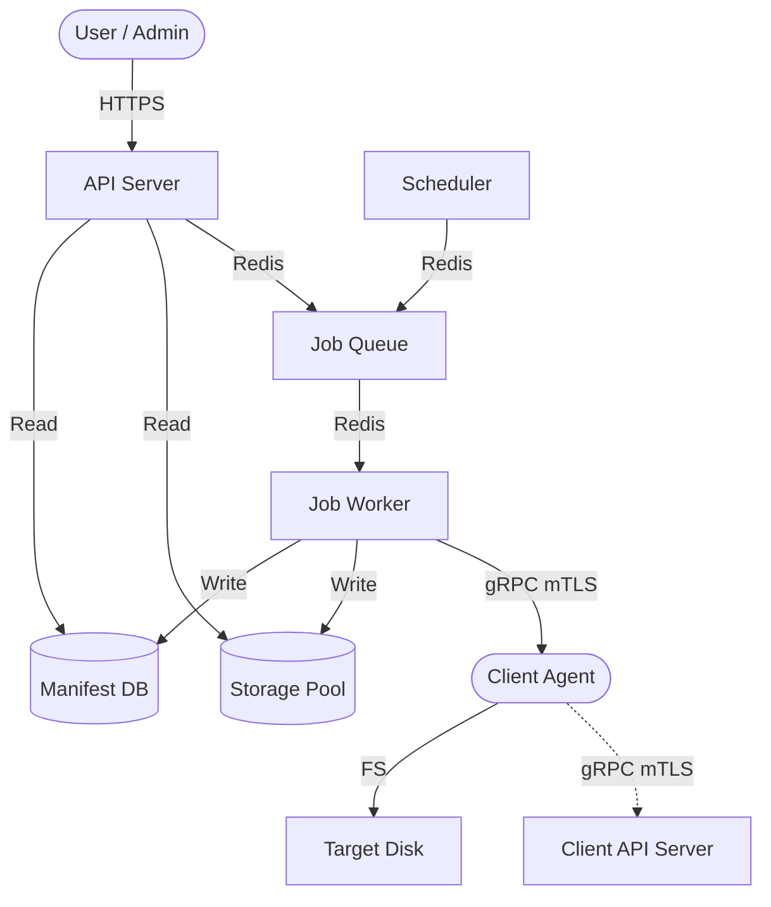

# Global Architecture

## Overview

Woodstock Backup is designed as a distributed system following the **Pull** model. The central server orchestrates and triggers backups by connecting to secured client agents to retrieve data.

### High-Level Diagram

## Core Principles

### 1. Pull Model

Unlike systems where clients push their backups, Woodstock uses a Pull model:

* **Security**: Clients have no write access to the backup storage. If a client is compromised, it cannot delete or alter existing backups.
* **Control**: The server centrally manages the schedule, retention policy, and network load.

### 2. Server-Side Micro-Architecture

The "Server" is not a single process but a collection of specialised binaries working in concert:

* **API Server (`api_server`)**: Management interface for the Frontend (Vue.js). Exposes a REST API and a **GraphQL** API (with WebSocket Subscriptions for real-time progress). Does not perform heavy work.
* **Scheduler (`scheduler`)**: Lightweight metronome that injects tasks into the job queue via two CRON jobs (wakeup every 15 min + nightly maintenance at midnight UTC).
* **Job Worker (`job_worker`)**: Heavy-duty worker that processes backups, restores, and maintenance. Consumes 4 distinct Redis queues via **Apalis**. Can be scaled horizontally.
* **Client API (`client_api_server`)**: HTTP server with mTLS. Allows agents to register themselves (notify their network address). This is *not* a gRPC server — it is an Axum endpoint secured by client certificate.

### 3. Client-Server Communication

All communication between the server and agents goes through **gRPC** secured by **mTLS** (Mutual TLS).

* Each client has its own certificate signed by the server's certificate authority (CA).
* The server holds a certificate that is validated by the clients.
* The protocol is defined in `woodstock-rs/woodstock.proto` — service `WoodstockClientService`.
* Agents can also register via `client_api_server` (HTTP/mTLS) to communicate their network address to the server.

## Typical Backup Flow

1. **Scheduling**: The `scheduler` detects it is time to back up `host-abc`. It enqueues a `BackupQueueJob::Save` in Redis (atomic deduplication via `SET NX`).
2. **Pickup**: An available `job_worker` dequeues the job via **Apalis**.
3. **Connection**: The worker contacts the `ws_client_daemon` agent on `host-abc` via gRPC mTLS.
4. **Authentication**: JWT handshake (`authenticate()`).
5. **Snapshot**: The agent creates an instant snapshot (Btrfs on Linux) of the volume to back up.
6. **Scan & Indexing**: The agent traverses the snapshot via `synchronize_file_list()` and streams file metadata.
7. **Deduplication**: The worker calls `get_chunk_hash()` for each file — if the hash already exists in the Pool, the existing chunk is simply referenced.
8. **Differential Transfer**: For missing chunks, `get_chunk()` triggers data streaming into the Pool.
9. **Finalisation**: The server writes the backup Manifest (`%2Fshare.manifest`) and updates the refcounts.
10. **Progress**: Each step publishes an update via Redis Pub/Sub → GraphQL Subscriptions → Frontend.
11. **Cleanup**: The agent deletes the temporary snapshot via `close_backup()`.
