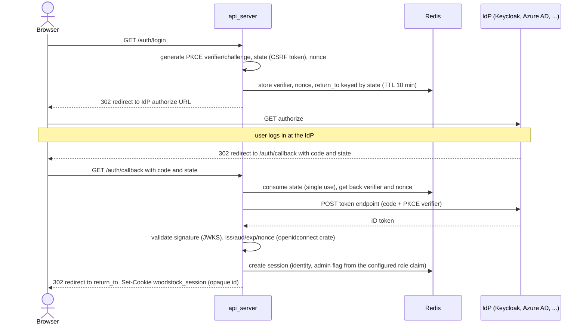

# Authentication (OpenID Connect)

Woodstock Backup does not implement its own login system. `api_server` (the REST +
GraphQL + WebSocket API that serves the frontend) optionally delegates authentication to
an external OpenID Connect provider — Keycloak, Azure AD/Entra ID, Okta, Authentik, or any
standards-compliant IdP. There is no provider-specific code: the server speaks plain OIDC
discovery + Authorization Code + PKCE against whatever issuer URL you configure.

This is entirely **opt-in**. With `OIDC_ENABLED` unset or `false` (the default), every
request is treated as an unrestricted administrator — identical to the server's behavior
before this feature existed. Existing deployments are unaffected until an operator
explicitly configures an IdP.

## What it protects

| Surface | Protected? |
|---|---|
| `/api/*` (REST) | Yes, once enabled |
| `/graphql`, `/graphql/ws` | Yes, once enabled |
| `/auth/*`, `/api/auth/config`, `/api/auth/me` | No — must stay reachable to log in at all |
| `/metrics` (Prometheus) | No — a scraper cannot do a browser OIDC redirect |
| `/api-docs` (Swagger UI) | No |
| The static SPA files | No — the SPA shell must load unauthenticated so it can itself redirect to `/auth/login` on a 401 from the API |
| Agent ↔ server (mTLS + JWT, `client_api_server`) | Unrelated, unaffected — that's a different identity (the *host*, proven by its client certificate), not a *person* |

## Architecture: Backend-For-Frontend (BFF)

The frontend is a Vue SPA with no server of its own, so the OIDC token exchange is not
done in the browser. Instead:

1. `api_server` itself performs the Authorization Code + PKCE exchange against the IdP.
2. The IdP's tokens (ID token, access token) stay server-side and are never returned to
   the browser.
3. The browser gets back an opaque, random session ID in an `HttpOnly`, `Secure`,
   `SameSite=Lax` cookie. It cannot be read or exfiltrated by JavaScript.
4. The session (identity, admin flag) is stored in Redis — the same store already used
   for job queues and distributed locks — with a TTL (`OIDC_SESSION_TTL_SECS`).

This avoids ever shipping an ID/access token to client-side JavaScript, and avoids needing
any OIDC library in the frontend at all.

### Login flow



### Logout

`POST /auth/logout` deletes the Redis session and clears the cookie, then responds with
`{"redirect_to": "..."}` for the SPA to navigate to next. If the IdP advertises an
`end_session_endpoint` ([OpenID Connect RP-Initiated Logout](https://openid.net/specs/openid-connect-rpinitiated-1_0.html)
— an optional but widely-supported extension, including by Keycloak), that URL is used
instead of `/`: without it, only the *local* Woodstock session ends, and the IdP's own SSO
session survives, so the very next `/auth/login` would silently re-authenticate the same
person instead of prompting them to sign in again. If the IdP doesn't support RP-Initiated
Logout, this falls back to a purely local logout (`redirect_to: "/"`) — no error, no
required configuration.

Building this URL (`OidcClient::end_session_url` in `server-rs/src/auth/oidc.rs`) needs
`OIDC_REDIRECT_BASE_URL` registered as a **post-logout** redirect target on the IdP client,
in addition to the login callback — see the Keycloak setup notes below.

### Nothing here is hand-rolled cryptography

Validating an ID token (JWKS signature check, `iss`/`aud`/`exp`/`nonce`) is exactly the
kind of code where a small mistake becomes an authentication bypass, and it is not
something this project writes or maintains itself. The whole OIDC client — discovery,
PKCE, the code exchange, and ID token validation — is delegated to the
[`openidconnect`](https://docs.rs/openidconnect) crate (`server-rs/src/auth/oidc.rs`). The
code here only reads already-validated claims out of the result.

## Roles and host ownership

Two roles:

- **admin** — full access to every host, every event, and the maintenance operations
  (`cleanupPool`, `checkAndFixPool`, `clearCache`, application logs). Determined by a
  claim in the ID token, not by anything stored in Woodstock's own configuration.
- **user** — restricted to the hosts they own.

### Determining admin membership

Every IdP names its role/group claim differently (Keycloak: `realm_access.roles`; many
generic OIDC/Azure AD setups: a flat `groups` array), so this is configurable rather than
hardcoded:

- `OIDC_ADMIN_ROLE_CLAIM_PATH` (default `realm_access.roles`) — a dotted path into the ID
  token claims. A single segment (e.g. `groups`) reads a top-level claim directly.
- `OIDC_ADMIN_ROLE_VALUES` (default `admin`, comma-separated) — the value(s) that, if
  present in the resolved claim (a string or an array of strings), grant the admin role.

### Host ownership

A host can belong to **several** users (a shared family PC, a workstation used by
multiple employees). Add an `owners` list to the host's `<hostname>.yml`:

```yaml
password: ...
operations:
  ...
owners:
  - alice
  - bob
```

- `owners` is matched case-insensitively against the claim named by `OIDC_IDENTITY_CLAIM`
  (default `preferred_username`; `email` is a common alternative).
- **`owners` is edited by hand in the YAML file** — there is no admin UI or GraphQL
  mutation for it in this version, consistent with the rest of host configuration today
  (nothing in the codebase writes `<hostname>.yml`; it is hand-provisioned). A
  configuration UI is planned separately.
- Missing or empty `owners` (including every `<hostname>.yml` written before this field
  existed) means **admin-only**, not "visible to everyone" — the secure default.
- Editing `owners` can take up to the host config cache's TTL (24h, shared with the rest
  of `woodstock::config::Hosts`) to take effect, unless the cache is explicitly
  invalidated. There is currently no dedicated command for this beyond the existing
  `invalidate_host_config_cache`/`invalidate_hosts_list_cache` calls used internally —
  budget for that delay (or a service restart, which does **not** clear it since the cache
  lives in Redis, not in-process memory) when testing an ownership change.

### What "restricted to owned hosts" covers

- Host list/detail, backups, files, logs, and event history (`Backup`/`Restore`/`Delete`
  events carry a hostname; `Pool`/`PoolCleaned`/`HashConversion` maintenance events are
  global and therefore admin-only, since there's no host to check ownership against).
- Live subscriptions (`jobUpdated`, `backupUpdated`) are filtered per-item, not just at
  connection time, so an unfiltered `jobUpdated` subscription (no `host` argument) never
  streams another user's job.
- The host-client-download endpoint (`GET /api/hosts/{name}/client`) is **admin-only**
  even for a host's own owner: it hands out a fresh mTLS agent-enrollment bundle
  (certificate + password), which is a materially different privilege than viewing
  backups.

## Configuration reference

All environment variables, read once at startup (see `server-rs/src/api/config.rs`):

| Variable | Default | Meaning |
|---|---|---|
| `OIDC_ENABLED` | `false` | Master switch. `false` = no authentication, unchanged behavior. |
| `OIDC_ISSUER_URL` | — | The IdP's issuer URL (discovery is `{issuer}/.well-known/openid-configuration`). |
| `OIDC_CLIENT_ID` | — | OAuth2 client ID registered with the IdP. |
| `OIDC_CLIENT_SECRET` | — (unset) | Client secret, for a confidential client. Leave unset for a public client (PKCE only). |
| `OIDC_REDIRECT_BASE_URL` | — | Base URL the **browser** uses to reach this server (e.g. `https://backup.example.org`). `/auth/callback` is appended. |
| `OIDC_ADMIN_ROLE_CLAIM_PATH` | `realm_access.roles` | Dotted claim path checked for admin membership. |
| `OIDC_ADMIN_ROLE_VALUES` | `admin` | Comma-separated values that grant admin. |
| `OIDC_IDENTITY_CLAIM` | `preferred_username` | Claim matched against a host's `owners` list. |
| `OIDC_SESSION_TTL_SECS` | `28800` (8h) | Session lifetime. Also the upper bound on how long a role change made on the IdP side takes to reach Woodstock: `is_admin` is captured from the ID token at login and stored as-is in the session, not re-checked against the IdP on every request (unlike `owned_hosts`, which is re-derived from local host config on every request and isn't affected by this). Revoking someone's admin role on the IdP takes effect the next time they log in — not immediately — unless you also delete their session (`woodstock:auth:session:{sid}` in Redis) or force a shorter TTL. |
| `OIDC_COOKIE_NAME` | `woodstock_session` | Session cookie name. |
| `OIDC_COOKIE_SECURE` | `true` | Marks the cookie `Secure` (HTTPS only). Only disable for local HTTP development. |

## Example with Keycloak

A ready-to-run Keycloak is wired into the repo's root `docker-compose.yml` for local
testing (see [Local testing](#local-testing-with-docker-compose) below). This section
covers the manual configuration steps, for reference or for pointing the server at an
existing Keycloak instance instead.

### Manual setup in the Keycloak admin console

1. **Create a realm** — e.g. `woodstock`.
2. **Create a client** — e.g. client ID `woodstock-backup`:
   - `Client authentication`: **On** for a confidential client (a secret is generated —
     copy it into `OIDC_CLIENT_SECRET`), or **Off** for a public client (PKCE only,
     `OIDC_CLIENT_SECRET` left unset).
   - `Standard flow` (Authorization Code): enabled. Other flows can stay disabled.
   - `Valid redirect URIs`: the login callback only, e.g.
     `http://localhost:3000/auth/callback`.
   - `Valid post logout redirect URIs`: `OIDC_REDIRECT_BASE_URL`'s root, e.g.
     `http://localhost:3000/`. This is a separate field from `Valid redirect URIs`
     (defaulting to `+`, meaning "same as `Valid redirect URIs`") — leaving it on `+` here
     rejects the logout redirect, since the root URL isn't in that list and Keycloak doesn't
     wildcard-match by default. Set it explicitly rather than adding the root URL to `Valid
     redirect URIs` too — no reason to accept a login redirect to a path this server never
     sends one to.
   - `Web origins`: only needed if the frontend is served from a different origin than
     `api_server`; leave empty otherwise.
3. **Create an admin role** — Realm roles → Create role → e.g. `admin`. Assign it to the
   accounts that should be Woodstock administrators (Users → pick a user → Role mapping →
   Assign role).
4. **Verify the claim ends up in the ID token, not just the access token** — this is the
   single most common reason "I assigned the role but it's still not admin" happens.
   `resolve_current_user` (`server-rs/src/auth/oidc.rs`) only ever reads claims off the
   validated **ID token**; it never calls the userinfo endpoint or inspects the access
   token. Keycloak's built-in `roles` client scope maps realm roles to
   `realm_access.roles` with **"Add to access token" on but "Add to ID token" off** — so
   the role is real, visible to other tools, and still invisible to Woodstock Backup. Fix
   it under **Client scopes → roles → Mappers → realm roles**, toggle **"Add to ID
   token"** on (either realm-wide there, or add a client-only override, as done in
   `docker/keycloak/woodstock-realm.json`'s `protocolMappers` for the bundled dev realm).
   A user who was already logged in when you fix this needs to log out and back in — the
   admin flag is captured once at login (see `OIDC_SESSION_TTL_SECS` above), not
   re-checked per request.
6. If a custom client scope/mapper changes where roles live (a different claim name, or a
   flat `groups` array instead of `realm_access.roles`), update
   `OIDC_ADMIN_ROLE_CLAIM_PATH`/`OIDC_ADMIN_ROLE_VALUES` to match.
7. **Pick the identity claim** — decide which Keycloak user attribute will be written into
   hosts' `owners` lists. `preferred_username` (the login name) is the default and usually
   the simplest; `email` is a common alternative if usernames aren't stable identifiers in
   your setup.
8. **Create test accounts** — at least one plain user (no admin role) and confirm it only
   sees hosts listed in its `owners`.

### Local testing with Docker Compose

The root `docker-compose.yml` includes a `keycloak` service (`quay.io/keycloak/keycloak`,
`start-dev --import-realm`) that auto-imports `docker/keycloak/woodstock-realm.json` —
a realm with the `woodstock-backup` client and an `admin` role already configured,
equivalent to manual steps 1–4 above. Bring it up alongside the rest of the stack:

```bash
docker compose up keycloak server-api valkey
```

Keycloak's admin console is at `http://localhost:8081` (`admin` / `admin`, from
`KC_BOOTSTRAP_ADMIN_USERNAME`/`KC_BOOTSTRAP_ADMIN_PASSWORD` in the compose file — change
these for anything beyond local testing). Create test accounts there (step 6 above), then
set `OIDC_ENABLED=true` on the `server-api` service (commented out by default in the
compose file, so `docker compose up` without editing anything keeps today's open-access
behavior) and restart it.

Two different base URLs are involved and are easy to mix up:

- `OIDC_ISSUER_URL=http://keycloak:8080/realms/woodstock` — how **`server-api`**, inside
  the Compose network, reaches Keycloak for discovery and the token exchange.
- `OIDC_REDIRECT_BASE_URL=http://localhost:3000` — how the **browser** reaches
  `server-api`, used to build the redirect URI the browser is sent back to.

If `server-api` is reachable from the browser at a different host/port, update
`OIDC_REDIRECT_BASE_URL` (and the client's `Valid redirect URIs` in Keycloak) accordingly.
