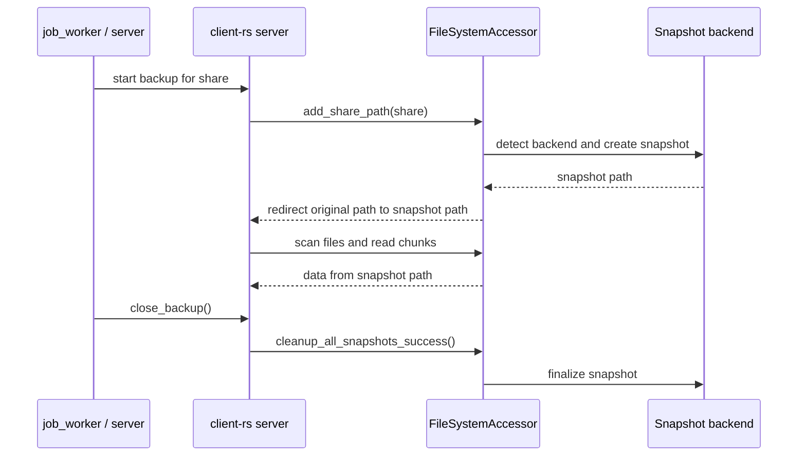

# Snapshot-backed Backups

This page explains how Woodstock Backup creates and uses filesystem snapshots during a backup.

## Overview

The client agent can create a snapshot of a share before scanning files.
The backup then reads data from the snapshot path instead of from the live filesystem.

This gives a more stable view of files that may still be modified while the backup is running.

Current backends:

- Linux: Btrfs
- Windows: VSS

The snapshot logic lives in `client-rs` and is built around two traits:

- `SnapshotManager`: detects whether a backend is available and creates a snapshot
- `SnapshotReference`: stores the redirection path and the information needed to finalize cleanup

## High-level Flow

## Path Redirection

The agent does not rewrite manifests to store snapshot-only paths.
Instead, it keeps a redirection map inside `FileSystemAccessor`:

- origin path: the share requested by the server
- alternative path: the snapshot path returned by the backend

Scanning and chunk reads use the alternative path.
Reported file paths are mapped back to the original share path.

## Lifecycle Management

Snapshot lifecycle is handled explicitly.

### Successful backup

When the backup reaches `close_backup()`, the agent finalizes snapshots with a success outcome.

- Btrfs snapshots are deleted normally
- VSS snapshots call `BackupComplete` before cleanup

### Aborted or interrupted backup

If a backup is interrupted, the agent uses abort cleanup paths.

- graceful shutdown calls snapshot cleanup before the process exits
- a new authentication also cleans orphaned snapshots from an older unfinished session
- VSS calls `AbortBackup` before deletion

For VSS, an abort can cause the snapshot to disappear before `DeleteSnapshots` runs.
This case is treated as an already-cleaned snapshot rather than as a hard failure.

## Windows VSS Specifics

The Windows backend uses the native VSS requester API.

Key points:

- VSS is used only for local drive-letter paths such as `C:\Data`
- UNC paths such as `\\server\share` are rejected for VSS snapshots
- the snapshot is accessed through the VSS snapshot device object
- the VSS requester session stays alive until finalization so that success and abort hooks can run correctly

## Current Limitations

- No explicit per-job or per-share snapshot policy is exposed in host configuration yet
- The client configuration schema contains a `snapshot` flag, but the full end-to-end policy wiring is not complete
- Linux support currently focuses on Btrfs; LVM and ZFS are not implemented yet

## Troubleshooting

If the backup does not use a snapshot:

1. Check whether the share path is on a supported filesystem.
2. Check agent logs for snapshot creation failures.
3. On Windows, verify that VSS is available and the agent runs with enough privileges.
4. Expect a live-filesystem fallback when snapshot creation is not possible.
