# Pool V3

## Vue d'ensemble

Pool V3 fait evoluer le pool Woodstock d'un modele base sur un tres grand nombre de fichiers de chunks vers un modele base sur des segments append-only et un index logique unifie.

Le chunk reste l'unite logique de deduplication et de comptage de references. Le segment devient l'unite physique de persistance sur disque.

L'implementation actuelle repose sur deux familles d'artefacts :

- des segments physiques dans `pool/segments/` ;
- un index unifie Heed/LMDB dans `pool/index/` ;
- des artefacts durables de backup (`pool-v3.staging`, `pool-v3.publication`, `pool-v3.removal`) dans les repertoires de backup ;
- des descripteurs `pending` sous `pool/index/pending/` pour rejouer les integrations interrompues.

## Objectifs techniques

Pool V3 doit fournir les proprietes suivantes :

- stockage append-only pour les ecritures normales ;
- lecture d'un segment pendant son ecriture ;
- publication idempotente des nouveaux chunks en fin de sauvegarde ;
- suppression idempotente des references d'une sauvegarde sans suppression immediate des segments ;
- reconstruction possible de l'etat logique a partir des segments et des manifests ;
- compaction sans reecriture en place des segments existants ;
- reprise propre apres crash sans double application logique ;
- absence de source de verite online non reconstructible.

## Principes structurants

Pool V3 repose sur les principes suivants :

- le hash reste l'identifiant logique d'un chunk ;
- le segment est l'unite physique de stockage ;
- l'index LMDB est la vue logique courante utilisee par les chemins normaux de lecture ;
- les segments et les manifests permettent de reconstruire cette vue en cas de corruption logique ;
- les locks Redis ne portent que des reservations temporaires ;
- la publication d'une sauvegarde se fait en deux temps : production d'un artefact durable, puis integration atomique dans l'index ;
- la suppression d'une sauvegarde suit le meme schema avec un delta negatif durable ;
- la compaction reecrit uniquement dans de nouveaux segments puis bascule l'index ;
- `size_effective` d'un segment est un agregat derive des chunks visibles, calcule comme la somme de `chunk_header_size + compressed_size` pour les chunks dont `ref_count > 0`.

Concretement, un chunk peut exister a plusieurs niveaux :

- present physiquement dans un segment ;
- present dans un staging de sauvegarde ;
- present dans un journal de publication ou de suppression ;
- visible logiquement via l'index LMDB.

Un chunk physiquement present mais absent de l'index n'est pas encore lisible par les chemins normaux de restauration.

## Structure sur disque

La structure sur disque est la suivante :

```text
/var/lib/woodstock/
├── hosts/
│   └── <hostname>/
│       └── <backup_id>/
│           ├── backup.log
│           ├── history.yml
│           ├── shares.yml
│           ├── statistics.yml
│           ├── %2Fetc.manifest
│           ├── %2Fetc.log
│           ├── pool-v3.staging
│           ├── pool-v3.publication
│           └── pool-v3.removal
└── pool/
    ├── segments/
    │   ├── seg-00000000001.seg
    │   ├── seg-00000000002.seg
    │   └── ...
    └── index/
        ├── data.mdb
        ├── lock.mdb
        └── pending/
            ├── publication-<hostname>-<backup_id>.pending
            ├── removal-<hostname>-<backup_id>.pending
            └── compaction-<uuid>.pending
```

Regles de structuration :

- `hosts/<hostname>/<backup_id>/` contient les artefacts durables lies a cette sauvegarde ;
- `pool/segments/` contient les segments physiques uniquement ;
- `pool/index/` contient l'environnement LMDB et le repertoire des operations `pending` ;
- les fichiers `pending` sont des descripteurs de reprise, pas la source primaire du delta ;
- aucun fichier `*.seg.meta` n'est utilise.

## Vue graphique d'ensemble

Les schemas suivants sont alignes avec l'implementation actuelle dans `woodstock-rs/src/pool/` :

- segments append-only sous `pool/segments/` ;
- index unifie Heed/LMDB sous `pool/index/` ;
- artefacts `staging`, `publication`, `removal`, `pending` en protobuf longueur-prefixee ;
- manifests existants qui referencent des hashes de chunks et non des localisations physiques.

### Carte du stockage Pool V3

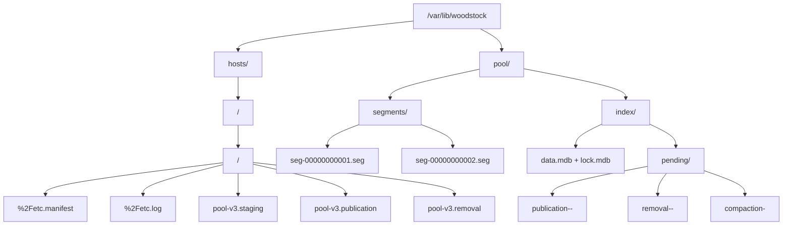

### Modele logique des entites

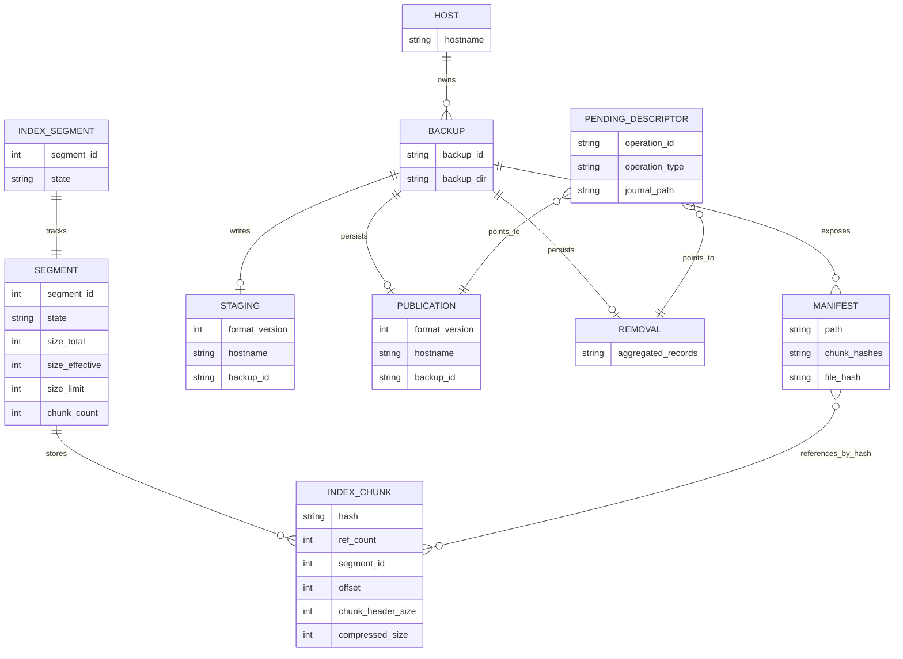

### Relation entre manifest, index et segment

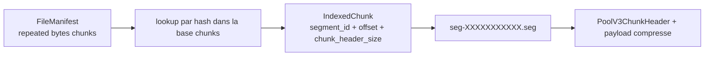

### Cycle de vie d'un segment

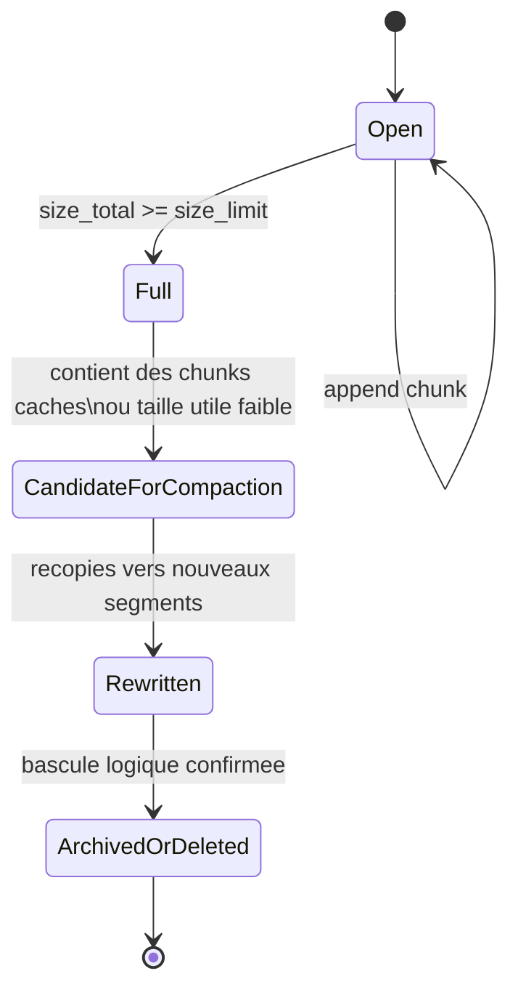

## Segments

### Role du segment

Le segment est l'unite physique du pool.

Proprietes retenues :

- fichier append-only ;
- taille maximale parametrable ;
- valeur par defaut actuellement retenue : 512 MiB ;
- un segment est considere comme plein des qu'il atteint ou depasse sa limite configuree ;
- un chunk peut faire depasser la limite ;
- le depassement reste borne par la taille maximale d'un chunk.

### Format sur disque

Le format retenu est lineaire et reconstruisible.

Un segment est compose de deux zones logiques :

1. un header de segment ;
2. une suite d'entrees de chunks.

#### Header de segment

Le header de segment est encode en protobuf longueur-prefixee.

Il contient :

- `format_version` ;
- `segment_id` ;
- `target_size` ;
- `created_at`.

Le nom du fichier segment est derive directement de l'identifiant logique du segment :

- `seg-00000000001.seg`

Il n'existe pas de sidecar de metadonnees. Le fichier segment est autoportant.

#### Entree de chunk

Chaque chunk stocke dans le segment est precede d'un en-tete protobuf longueur-prefixee contenant :

- le hash du chunk ;
- la taille non compressee ;
- la taille compressee ;
- le format de compression.

Puis vient le payload compresse du chunk.

Cette structure permet :

- de rescanner un segment ;
- de verifier sa coherence interne ;
- de reconstruire la carte physique des chunks a partir du segment lui-meme.

#### Messages protobuf

```proto
syntax = "proto3";

package woodstock;

message PoolV3SegmentHeader {
    uint32 format_version = 1;
    uint64 segment_id = 2;
    uint64 target_size = 3;
    uint64 created_at = 4;
}

message PoolV3ChunkHeader {
    bytes hash = 1;
    uint64 size = 2;
    uint64 compressed_size = 3;
    uint32 compression_format = 4;
}
```

#### Ordonnancement binaire

Le fichier segment suit l'enchainement suivant :

1. un `PoolV3SegmentHeader` encode en protobuf longueur-prefixee ;
2. pour chaque chunk :
   - un `PoolV3ChunkHeader` encode en protobuf longueur-prefixee ;
   - le payload compresse du chunk sur `compressed_size` octets.

#### Schema du format interne d'un segment

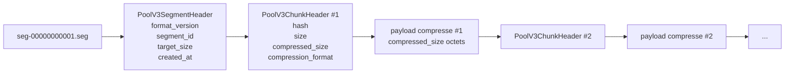

#### Schema des messages protobuf du segment

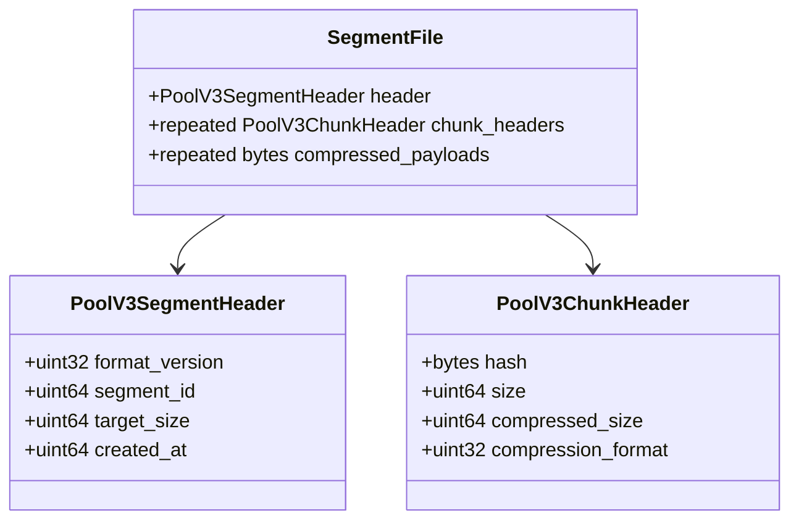

## Index logique unifie

### Role de l'index

L'index logique courant est stocke dans un environnement Heed/LMDB unique sous `pool/index/`.

Il sert a :

- resoudre un chunk visible par son hash ;
- suivre l'etat des segments (`Open` ou `Full`) ;
- conserver les compteurs de references ;
- memoriser l'idempotence des publications et suppressions deja integrees ;
- fournir l'etat courant a la restauration, a la suppression et a la compaction.

L'index n'est pas la source physique des chunks. Il reste recalculable par `fsck` a partir des segments et des manifests.

### Bases LMDB

L'implementation actuelle utilise cinq bases nommees :

- `chunks` : cle = hash SHA-256 brut, valeur = localisation physique et metadonnees logiques du chunk ;
- `segments` : cle = `segment_id`, valeur = etat logique agrege du segment ;
- `merged_backups` : tombstones des sauvegardes dont la publication a deja ete integree ;
- `removed_backups` : tombstones des sauvegardes dont la suppression a deja ete integree ;
- `metadata` : metadonnees globales, notamment le prochain `segment_id` et la version de format.

### Contenu logique

Une entree `chunks` contient au minimum :

- le hash ;
- la taille non compressee ;
- la taille compressee ;
- le format de compression ;
- `ref_count` ;
- `segment_id` ;
- l'offset du header de chunk dans le segment ;
- la taille de l'en-tete de chunk.

Une entree `segments` contient au minimum :

- `segment_id` ;
- l'etat `Open` ou `Full` ;
- `size_total` ;
- `size_effective` ;
- `size_limit` ;
- `chunk_count`.

Dans l'implementation actuelle, `size_effective` represente la taille stockee encore visible dans un segment, soit la somme de `chunk_header_size + compressed_size` pour les chunks dont `ref_count > 0`.

### Schema logique de l'index LMDB

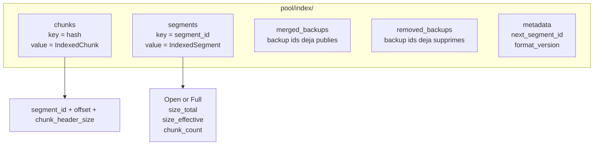

### Idempotence et reprise

Les bases `merged_backups` et `removed_backups` sont necessaires.

Elles evitent de reappliquer deux fois une integration logique si un crash survient :

- apres creation de l'artefact durable ;
- apres creation du descripteur `pending` ;
- pendant l'application dans l'index ;
- apres le commit LMDB mais avant le nettoyage du fichier `pending`.

Le principe est simple :

- la publication logique d'un backup se termine par l'enregistrement de son identifiant dans `merged_backups` ;
- la suppression logique d'un backup se termine par l'enregistrement de son identifiant dans `removed_backups` ;
- si un `pending` reapparait au redemarrage, l'operation peut etre rejouee sans double application grace a ces tombstones.

## Artefacts de backup et `pending`

### Staging

`pool-v3.staging` contient la liste des chunks physiquement prepares pour une sauvegarde avant leur publication logique.

Dans l'implementation actuelle, `pool-v3.staging` est un flux protobuf longueur-prefixee de `PoolV3StagingEnvelope` :

1. un premier envelope avec `header = PoolV3StagingHeader` ;
2. puis une suite d'envelopes avec `entry.chunk = PoolV3StagingChunkEntry`.

### Publication

`pool-v3.publication` contient le delta logique positif durable d'une sauvegarde. Il sert a :

- publier un backup dans l'index ;
- reconstruire un delta de suppression sans rescanner tous les manifests ;
- reprendre une publication interrompue.

Dans l'implementation actuelle, `pool-v3.publication` suit le meme schema d'enveloppes que `staging` :

1. un premier `PoolV3PublicationHeader` ;
2. puis une suite de `PoolV3PublicationChunkEntry` enveloppes.

### Removal

`pool-v3.removal` contient le delta logique negatif durable d'une sauvegarde.

Dans l'implementation actuelle, `pool-v3.removal` ne contient pas encore un couple header plus enveloppes. Le fichier est une suite longueur-prefixee de `PoolV3RemovalChunkRecord`, agregee par hash.

### Pending

Les fichiers `pending` sous `pool/index/pending/` ne dupliquent pas le contenu des deltas. Ils ne font que declarer une integration a rejouer.

Un descripteur `pending` identifie :

- le type d'operation ;
- l'hote et le backup concernes si applicable ;
- le chemin de l'artefact durable a consommer.

Concretement, le fichier `pending` est un unique `PoolV3PendingHeader` longueur-prefixee contenant aussi `operation_id`, `journal_path` et `created_at`.

### Schema des formats d'artefacts

```mermaid
flowchart TB
    subgraph staging["pool-v3.staging"]
        st_h["PoolV3StagingHeader"] --> st_e1["PoolV3StagingEnvelope(entry.chunk)"]
        st_e1 --> st_e2["PoolV3StagingEnvelope(entry.chunk)"]
        st_e2 --> st_more["..."]
    end

    subgraph publication["pool-v3.publication"]
        pub_h["PoolV3PublicationHeader"] --> pub_e1["PoolV3PublicationEnvelope(entry.chunk)"]
        pub_e1 --> pub_e2["PoolV3PublicationEnvelope(entry.chunk)"]
        pub_e2 --> pub_more["..."]
    end

    subgraph removal["pool-v3.removal"]
        rem_1["PoolV3RemovalChunkRecord"] --> rem_2["PoolV3RemovalChunkRecord"]
        rem_2 --> rem_more["..."]
    end

    subgraph pending["pool/index/pending/<operation_id>"]
        pend_h["PoolV3PendingHeader\noperation_id\noperation_type\nhostname\nbackup_id\njournal_path\ncreated_at"]
    end

    subgraph manifest["%2Fshare.manifest"]
        man["FileManifest\npath\nstats\nrepeated bytes chunks\nhash"]
    end
```

### Schema des structures protobuf des artefacts

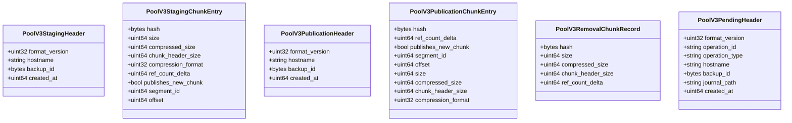

## Flux principaux

### Ecriture d'un nouveau chunk

1. reserver un segment `Open` ou en creer un nouveau ;
2. ecrire physiquement le chunk dans ce segment ;
3. inserer ou mettre a jour l'entree de chunk dans l'index avec `ref_count = 0` ;
4. enregistrer ce chunk dans le staging du backup.

### Finalisation d'une sauvegarde

1. transformer le staging en journal `pool-v3.publication` durable ;
2. deposer un descripteur `pending` de publication ;
3. appliquer atomiquement le delta dans l'index LMDB ;
4. enregistrer le backup dans `merged_backups` ;
5. supprimer le `pending` et eventuellement le staging.

Une publication n'est consideree comme deja finalisee sans artefact present que si le tombstone `merged_backups` existe deja.

### Schema de publication d'une sauvegarde

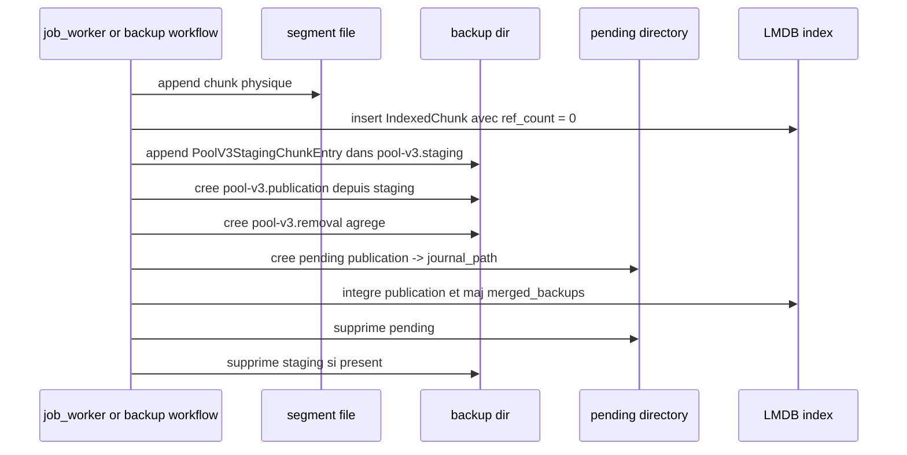

### Suppression d'une sauvegarde

1. produire `pool-v3.removal` a partir du journal de publication ;
2. deposer un descripteur `pending` de suppression ;
3. appliquer atomiquement le delta negatif dans l'index ;
4. enregistrer le backup dans `removed_backups` ;
5. supprimer le `pending`, puis le repertoire de backup quand le workflow host le permet.

### Schema de suppression d'une sauvegarde

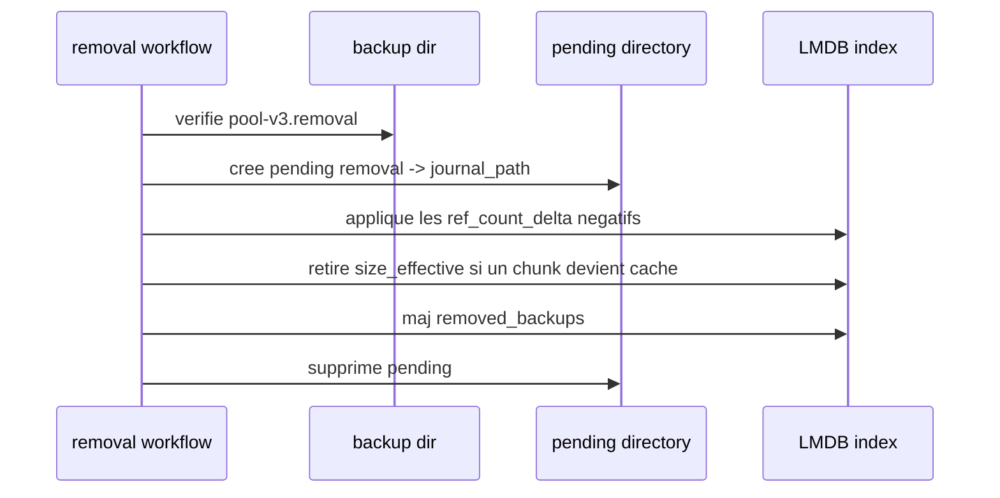

### Compaction

1. selectionner des segments dont `size_effective` est faible relativement a `size_total` ;
2. recopier uniquement les chunks visibles vers de nouveaux segments ;
3. produire le delta logique de remplacement ;
4. appliquer atomiquement ce delta dans l'index ;
5. supprimer ou archiver les anciens segments une fois la bascule logique confirmee.

La compaction ne reecrit jamais un segment en place.

### Schema de compaction

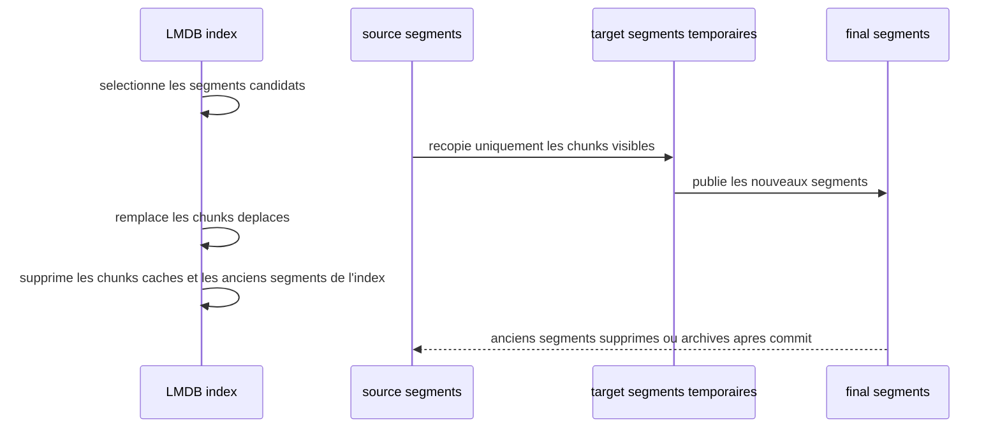

## Lecture et restauration

Les chemins normaux de lecture resolvent un chunk via l'index `chunks` :

1. recherche par hash ;
2. recuperation du `segment_id`, de l'offset et de la taille du header ;
3. ouverture du segment ;
4. lecture bornee du payload compresse ;
5. decompression et verification logique habituelle.

Les restaurations ne rescannent pas les segments tant que l'index est coherent.

## Fsck et reconstruction

Le modele de verification actuel repose sur deux axes :

- verification physique des segments en les rescannant ;
- verification logique de l'index en le comparant a un etat rebati depuis les manifests et les segments.

Un rebuild complet doit pouvoir :

- relister tous les segments ;
- relire tous les headers de chunk ;
- recalculer les entrees `chunks` et `segments` ;
- recalculer `size_effective` a partir des manifests et des tailles stockees visibles (`chunk_header_size + compressed_size`) ;
- detecter les chunks references mais absents physiquement ;
- detecter les doublons physiques et les incoherences de compteurs.

La suppression du sidecar de segment renforce ce point : la verite physique vient uniquement du fichier `.seg`.

## Contraintes retenues

- pas de reecriture en place des segments ;
- pas de sidecar `*.seg.meta` ;
- pas de dependance a un checkpoint externe pour l'etat logique courant ;
- pas de suppression physique immediate d'un segment simplement parce qu'il n'est plus visible ;
- pas de double application logique apres crash, grace aux tombstones `merged_backups` et `removed_backups`.

## Consequences pratiques

- le cout de reopen d'un segment reste faible car seul son header est lu ;
- les compteurs exacts d'un segment apres reopen sont recalcules par scan quand necessaire ;
- l'index LMDB porte l'etat online, mais `fsck` garde la capacite de tout reconstituer ;
- la suppression et la compaction restent des operations logiques avant d'etre des operations de nettoyage physique.
