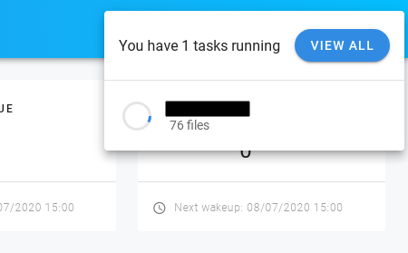

# About Woodstock Backup

**Woodstock Backup** is a software that can be used to backup many hosts on a centralized server. With the help of deduplication, the storage is minimized.

**Woodstock Backup** is written in Javascript (NodeJS for the server and Vue for the client). The backup are stored in a btrfs volume with rsync. **Woodstock Backup** is open source and licensed with MIT Licence.

## BackupPC Features

- A modern interface with accessible API that can be used to launch backup,
- With the help of Btrfs, different backups of the same host are stored efficiently,
- Btrfs can use the compression to reduce the size of files ; it can be configured at mount time,
- Rsync is used to make backup without client. Rsync is a safe tool used regularly to make backup,
- Access to file can be made through the modern interface, the api, or the storage,
- Backup of computer with dynamic IP or only intermittenlty connected to the network,
- Open Source and freely availble under MIT.

## Screen Shots

Here are some screen shots of BackupPC's web interface that provide an overview of various BackupPC features.

